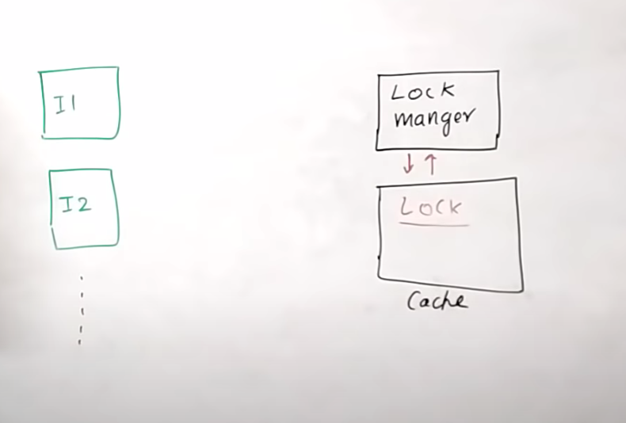
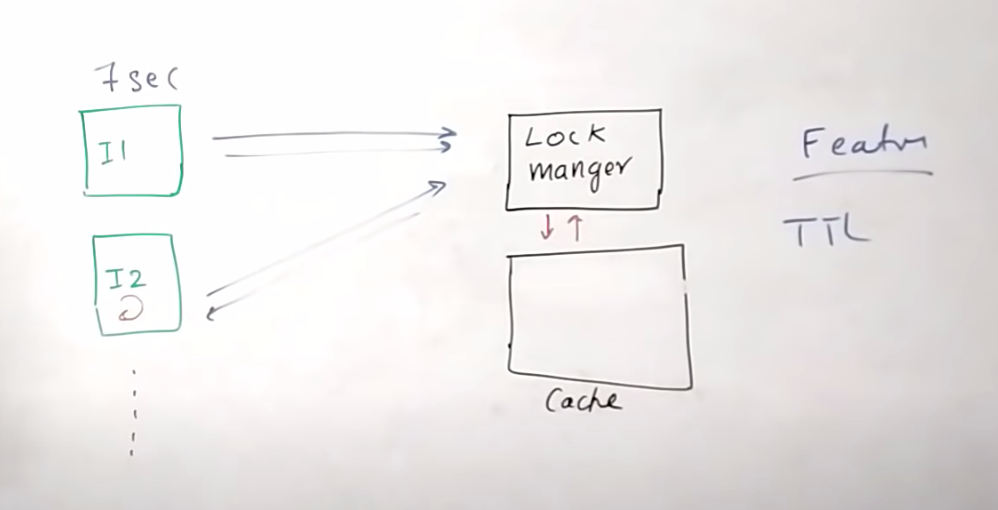
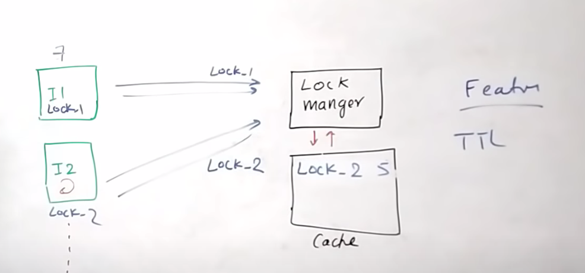
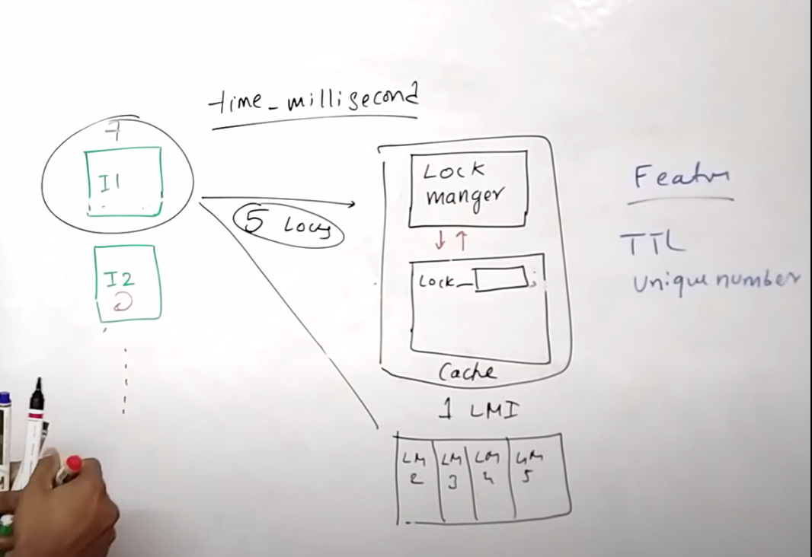

# Basics
Following three building blocs
1. Locks
2. Mutex
3. Semaphore

- Locks and mutex are little bit similar. 
- Locks are used to lock the critical section from threat of same process usually
- mutex allows us to lock critical section of file/object from multiple process. 
- Semaphore allows particular group of accesser/threads to allow particular section of critical section.
- Also, counting semaphore to count number of accessor using critical section. 
- On chrome, you can have 6 or 7 connection per hostname. 
- You can use semaphore to count number of open connections per hostname. 
- Mutex, say multiple process are running and trying to log into a same file on same line. We need to lock to define write/read.   
# Distributed locks
- Multiple micro services
# lock using database
# Distributed lock 
- Mutual exclusion
- Deadlock free
- Fault tolerance 

# Database based lock

# Lock manager

# Lock manager with TTL

